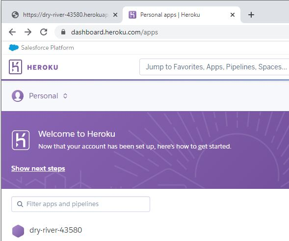
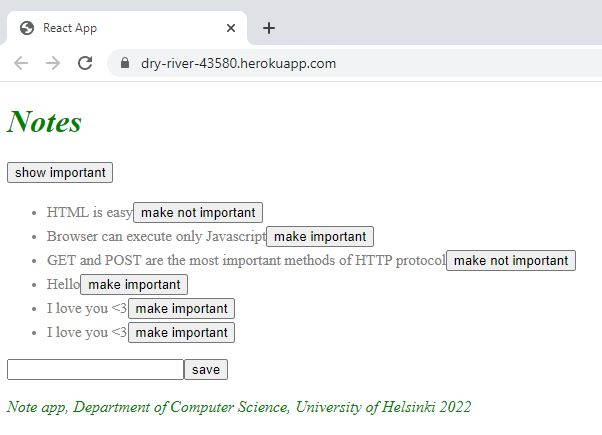

# Notes app# Part 3: Following course

## following course b) Deploying app to internet
This backend server in Node returns notes using the Express library which provides an interface to work with the built-in http module. 

This application is deployed using Heroku, a platform as a service (PaaS) that enables developers to build, run, and operate applications entirely in the cloud. 

The frontend production build is added in the backend to deploy the whole application.

## Here is the link of the deployed application:
https://dry-river-43580.herokuapp.com/
https://dry-river-43580.herokuapp.com/api/notes

## This project contains two sections:
### BE
- https://github.com/baotranC/fullstackopen2022_part3_followingCourse_BE
### FE
- https://github.com/baotranC/fullstackopen2022/tree/main/part3/followingCourse/courseexample_b_part2_courseexample_e_Frontend

## CRUD API (resource oriented architecture). 
These are the possible requests: 
- Fetch all notes/resources: GET http://localhost:3001/api/notes
- Fetch a single note/resource: GET http://localhost:3001/api/notes/[insert id]
- Delete a note/resource: DELETE http://localhost:3001/api/notes/[insert id]
- Adding a note resource: POST http://localhost:3001/api/notes
    Content-Type: application/json
    {
        "content": "Postman is a good tool for testing REST-api",
        "important": true
    }

## Others
### Tools to test API
These tools allow to test HTTP requests

#### - Postman 
#### - Visual Studio Code REST client plugin 

## Run 
- `npm start`
Runs the node server 
Open [http://localhost:3001](http://localhost:3001) to view the application.
Open [http://localhost:3001/api/notes](http://localhost:3001/api/notes) to view all the notes on the server using the browser.

- `npm run dev`
Run the application. The server runs in the development mode using Nodemon 
Open [http://localhost:3001](http://localhost:3001) to view the application.
Open [http://localhost:3001/api/notes](http://localhost:3001/api/notes) to view all the notes on the server using the browser.

- `npm run build:ui`
Builds the frontend and copies the production version under the backend repository

- `npm run deploy`
Releases the current backend to Heroku.

- `npm run deploy:full`
Combines these two and contains the necessary git commands to update the backend repository.

- `npm run logs:prod`
Show the Heroku logs.